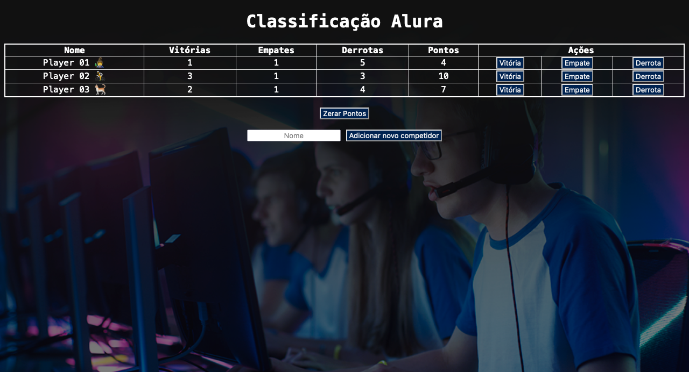

# Objetos e tabelas de classificação

### Screenshot



https://imersao.dev/aulas/aula06-objetos-tabelas-classificacao

### Conteúdo detalhado desta aula:

- Remover o código estático do HTML;
- Criar um objeto no Javascript para cada jogador;
- Criar uma função que receba um objeto como parâmetro para calcular os pontos;
- Exibir o objeto na página HTML;
- Criar uma função para adicionar vitória, outra para adicionar empate e uma última para adicionar derrota;
- Recalcular os pontos quando vitória ou empate for adicionado.

### Desafios desta aula!

- [x] Fazer a lógica de quando houver um empate, obrigatóriamente deveria já ajustar como empate para os demais jogadores;

```js
function adicionarEmpate() {
  for (var index = 0; index < jogadores.length; index++) {
    jogadores[index].empates++;
    jogadores[index].pontos = calculaPontos(jogadores[index]);
  }

  exibeJogadoresNaTela(jogadores);
}
```

- [x] Validar se todos os pontos estão fazendo sentido, tanto o número de empates, quanto derrotas e vitórias com os demais jogadores (impossível haver mais vitórias que derrotas, por exemplo);

```js
function adicionarVitoria(i) {
  var jogador = jogadores[i];
  jogador.vitorias++;
  for (var index = 0; index < jogadores.length; index++) {
    if (index == i) {
      continue;
    }
    jogadores[index].derrotas++;
  }
  jogador.pontos = calculaPontos(jogador);
  exibeJogadoresNaTela(jogadores);
}
```

- [x] Adicionar a imagem de cada jogador;

```js
elemento += "<tr><td>" + jogadores[i].nome + " " + jogadores[i].emoji + "</td>";
```

- [x] Criar um botão para zerar todos os pontos;

```html
<button onClick="zerarPontos()">Zerar Pontos</button>
```

```js
function zerarPontos() {
  for (var index = 0; index < jogadores.length; index++) {
    jogadores[index].vitorias = 0;
    jogadores[index].empates = 0;
    jogadores[index].derrotas = 0;
    jogadores[index].pontos = calculaPontos(jogadores[index]);
  }
  exibeJogadoresNaTela(jogadores);
}
```

- [x] Criar um botão e inputs (campos de texto) para adicionar novos jogadores, com seus respectivos dados;

```html
<form onsubmit="adicionar()">
  <input id="novoNome" type="text" placeholder="Nome" required />
  <button type="submit">Adicionar novo competidor</button>
</form>
```

```js
function adicionar() {
  var nome = document.getElementById("novoNome").value;
  jogadores.push({
    nome: nome,
    emoji: "",
    vitorias: 0,
    empates: 0,
    derrotas: 0,
    pontos: 0,
  });
  exibeJogadoresNaTela(jogadores);
  document.getElementById("novoNome").value = "";
  // console.log(jogadores);
  event.preventDefault();
}
```

- [x] Utilizar seu jogo preferido para se basear na pontuação da sua tabela de classificação.

A [Pen](https://codepen.io/rhatiro/pen/ExRLqWR) by [rhatiro](https://codepen.io/rhatiro) on [CodePen](https://codepen.io).

[License](https://codepen.io/license/pen/ExRLqWR).
